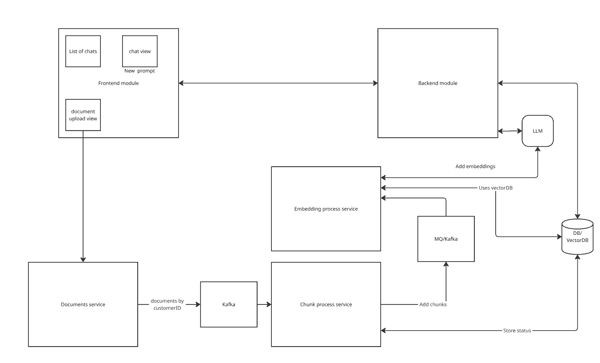

# rag-assistant

**TL;DR:** rag-assistant is a Retrieval-Augmented Generation app I'm building in the open. Right now it's one Spring Boot service, and it already works. Step by step I'm turning it into a handful of small services connected by Kafka, the same kind of event-driven system I build at my day job, so this repo shows real distributed-systems skill instead of just talking about it. It's also where I'm learning Claude Code, by actually using it to build the thing.

## Architecture Overview

### What's working today

- One Spring Boot app. Nothing fancy yet, and that's fine, it works.
- Send it a document (`POST /documents`) and in one single step it chunks the text, turns the chunks into vectors with a local model (Ollama), and saves them in Postgres (pgvector).
- Ask it a question (`POST /ask` or `/ask/stream`) and it looks up the closest matching chunks and asks Claude to answer using them.
- Two automated tests already exist to check the AI side actually works: one checks the right chunk gets found for a query, the other uses a second AI call to grade whether the answer is any good. I built these before touching anything else, on purpose, so I'd know the moment something breaks.
- No Kafka yet. No separate services yet. No frontend, I've been testing it through Postman.

### Where it's going

- **Documents Service**: the front door. Takes in a document and publishes one Kafka message with the whole document in it. No chunking here, that happens later. Each message carries a `customerID` as its Kafka key (more on what that does and doesn't buy you, below).
- **Chunk Process Service**: listens for new documents on Kafka, splits them into chunks, tracks status, and publishes one message per chunk.
- **Embedding Process Service**: listens for chunks, turns them into vectors, and saves them.
- **Backend Module**: answers questions, same job as today, just backed by a pipeline that fills up in the background instead of one blocking call that does everything at once.
- **Frontend**: doesn't exist yet. I'll build it with Claude Code, since frontend isn't my strong side, and the repo becomes one monorepo: a folder for the frontend, a folder per service.
- Every service is its own deployable, but the whole thing comes up together with one `docker-compose up`.

**A note on that customerID key.** It's not the same thing as saying "the system treats every customer fairly," and I want to be precise about the difference. A key means Kafka keeps every message for the same customer in order, on the same partition. It does not, by itself, stop one very active customer from filling up that partition and slowing everyone else sharing it down, the classic noisy-neighbor problem. Real fairness needs something on top: per-customer rate limits at the consumer, or splitting a very heavy customer across more than one partition. I haven't built that part yet. It's on the roadmap, named honestly instead of glossed over.

**A note on document size.** Right now a whole document goes into a single Kafka message, which means it has to be small enough to fit (Kafka's default limit is about 1MB). Large documents aren't handled yet. When I get there, I'll reach for the claim-check pattern instead of slicing before Kafka: store the raw document where I already can (Postgres), and put a reference to it in the message instead of the content itself. Keeps every message small no matter how big the source document is.

## Why I Built It This Way

**Kafka, even though I don't need it yet.** Honestly, for one person calling this API, Spring's built-in event system would do the job, for free. I picked Kafka anyway, because the point of this project is to practice the same pattern I run at work (Kafka replacing a slow batch job, feeding dozens of downstream systems), not to build the smallest thing that works. The cost: now there's a broker to run and messages to design carefully, for a demo with one user.

**Separate services, not just separate packages.** The Documents, Chunk, and Embedding pieces are built and deployed as their own services, not folders inside one big app. That's more work: real contracts between services (the Kafka topic is the API now), a docker-compose file to keep them all talking. But it's the only version that actually proves I can design a distributed system, instead of describing one.

**Track status and avoid duplicates now, full replay later.** The production system this is modeled on can replay any customer's data on demand, that's a real safety net. Building that here first would be the most impressive thing I could do, and also the most time for the least learning value, because replay assumes you've already solved a simpler problem: knowing what state every document is in, and not processing the same message twice. So that's what's getting built first: a status per document (received, chunking, embedding, indexed, failed), and IDs that make re-processing the same message a no-op instead of a duplicate. Replay becomes a natural next step from there, not a redesign, whenever I want it.

**Local embeddings, hosted model for answers.** Embeddings run on Ollama, free and local. Answers come from Claude. Embeddings happen constantly, every chunk of every document, answers happen once per question. So the cheap, fast thing runs on the frequent step, and the good, more expensive thing runs on the rare one.

**Tests before the fancier architecture.** A retrieval test and an AI-graded answer-quality test existed before Kafka entered the picture. Better to know the thing actually works before making it more complicated.

## Tech Stack

Java 21, Spring Boot 3.5, Spring AI 1.1.7, Apache Kafka (in progress), PostgreSQL with pgvector, Ollama (local embeddings, `nomic-embed-text`), Anthropic Claude (answers), Docker / Docker Compose, JUnit 5 with Spring Boot Test.

## Getting Started (Today's Version)

You'll need Java 21, Docker, and an `ANTHROPIC_API_KEY`.

1. Start Postgres (with pgvector), Ollama, and Kafka: `docker compose up -d`. First run also creates the `documents` Kafka topic.
2. Pull the embedding model: `ollama pull nomic-embed-text` (run against the Ollama container).
3. Set `ANTHROPIC_API_KEY` (and `DB_USERNAME` / `DB_PASSWORD` if you're not using the defaults in `application.yml`).
4. Run it: `./mvnw spring-boot:run`.
5. Add a document: `POST /documents` with `{ "title": "...", "content": "..." }`.
6. Ask something: `POST /ask` with `{ "question": "..." }`, or stream it: `GET /ask/stream?question=...`.

## Built with Claude Code

The services above are being built with Claude Code, using real subagents, skills, and MCP tools to actually do the work, not just autocomplete for individual files. Claude Code is part of the architecture here, not just the editor.

## What's Next

- [x] One docker-compose command for Postgres/pgvector, Ollama, and Kafka
- [ ] Documents / Chunk / Embedding services, actually separate, actually talking over Kafka
- [ ] Per-document status and duplicate-safe processing
- [ ] Real fairness between customers, not just a customerID key (rate limiting, maybe partition-splitting for big customers)
- [ ] Handle large documents (claim-check pattern instead of stuffing the whole thing into one Kafka message)
- [ ] Frontend, and the repo becomes a monorepo
- [ ] Replay-on-demand for ingestion, once the basics above are solid

## License

PolyForm Noncommercial 1.0.0. Anyone can read it, run it, fork it, and learn from it. Nobody can sell it or relicense it to someone else. See [LICENSE](./LICENSE).